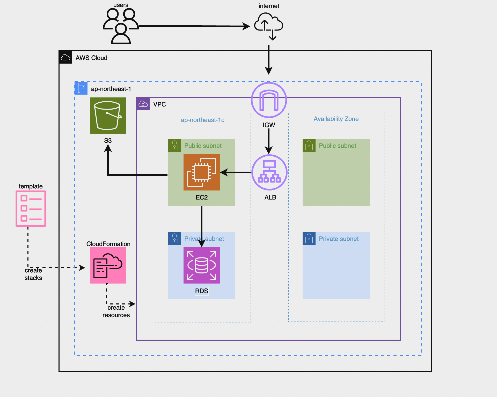

# 学習記録
　オンラインプログラミングスクール「RaiseTech」のAWSコースの学習記録

## 概要

- ①CRUD 処理が出来る簡単な Rails アプリケーションをEC2上にデプロイ
- ②Cloudformationを用いて環境構築を自動化


## 動作環境
### ruby
```bash
3.2.3
```
### Bundler
```bash
2.3.14
```
### Rails
```bash
7.1.3.2
```
### Node
```bash
v17.9.1
```
### yarn
```bash
1.22.19
```

## 現時点での構成図



--- 


以下、講座ごとの各課題を.mdファイルにまとめて、mainブランチにマージしています。

|講座|課題|レポート|
|:---|:---|:---|
|1回|<ul><li>AWSアカウントの作成<li>IAM設定作成<li>MFA保護<li>Cloud9の作成|Discord上に提出|
|2回|<ul><li>GitHubアカウントの作成<li>Cloud9のGitの設定変更<li>課題用リポジトリの作成<li>プルリクエストの練習|[lecture02.md](lecture02.md)|
|3回|<ul><li>RailsアプリケーションをCloud9上でデプロイ<li>APサーバー・DBサーバーの動作確認|[lecture03.md](lecture03.md)|
|4回|<ul><li>VPC・EC2・RDSの作成<li>EC2からRDSへの接続確認|[lecture04.md](lecture04.md)|
|5回|<ul><li>EC2にRailsアプリケーションをデプロイ<li>ALB・S3の追加<li>構成図の作成|[lecture05.md](lecture05.md)|
|6回|<ul><li>CloudTrailのイベント履歴確認<li>CloudWatchアラームを使いALBのアラーム設定→SNS通知<li>AWS利用料の見積書作成<li>現在のAWSの利用料金の確認|[lecture06.md](lecture06.md)|
|7回|<ul><li>システムにおけるセキュリティリスクの基礎<li>第5回で構築した環境の脆弱性と対策|[lecture07.md](lecture07.md)|
|8回|<ul><li>第5回課題の構築実演(1)|課題なし|
|9回|<ul><li>第5回課題の構築実演(2)|課題なし|
|10回|<ul><li>第5回で構築した環境のコード化(CloudFormation)|[lecture10.md](lecture10.md)|
|11回|<ul><li>ServerSpecを使用した自動テストの実施|11月受講予定|
|12回|<ul><li>DevOps<li>CI/CDツールについて<li>CircleCIについて|11月受講予定|
|13回|<ul><li>Ansibleの導入<li>CircleCIとの併用|12月受講予定|
|14回|<ul><li>第13回課題の構築実演(1)||
|15回|<ul><li>第13回課題の構築実演(2)||
|16回|<ul><li>現場へ出ていくために必要な知識・技術・立ち振る舞いについて||
