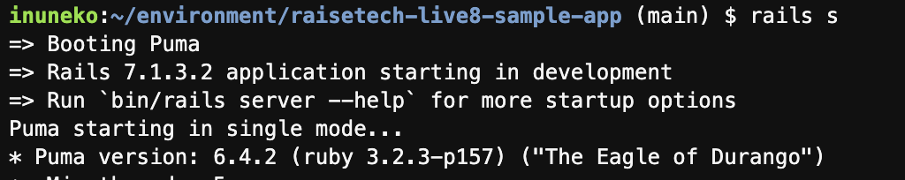
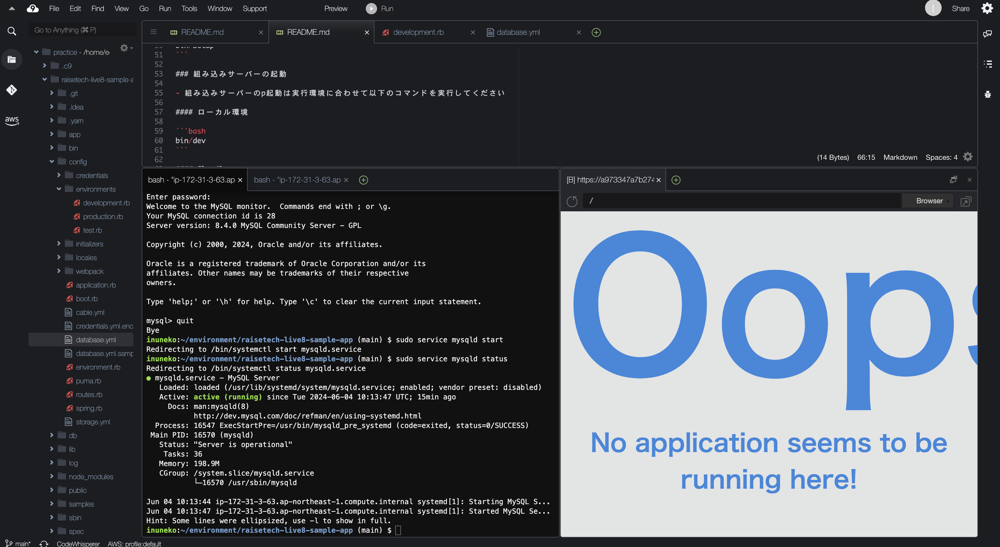
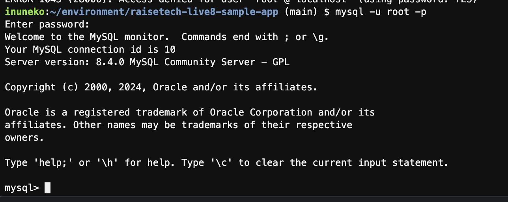
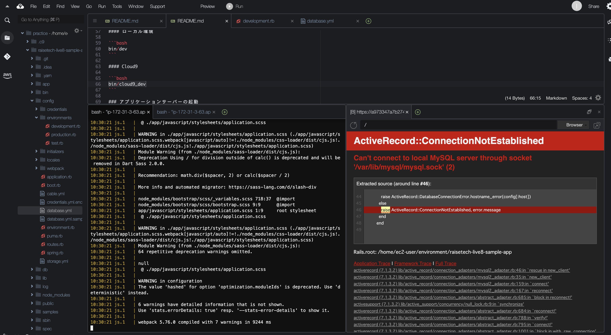

# 第3回課題

## 概要

**1. APサーバーの起動確認**

**2. DBサーバーの起動確認**

**3. 今回の課題から学んだこと、感じたこと**
 
## 内容 
 
**1. APサーバーの起動確認**

 

APサーバーの名前とバージョンは？

  - サーバー:**puma**

  - バージョン:**6.4.2**
 
 

APサーバーを終了させた場合、引き続きアクセスできるか？

  - <u>アクセスできない</u>
    
 

  - その後AP サーバーを起動すると<u>アクセスできる</u>

**2. DBサーバーの起動確認**

サンプルアプリケーションで使ったDBサーバー及びCloud9で動作しているバージョンは？

  - DBサーバー:**MySQL**

  - バージョン:**8.4.0**
    
 

DBサーバーを終了させた場合、引き続きアクセスできるか？

  - <u>アクセスできない</u>

 

Railsの構成管理ツールの名前は？

  - **bundler**

**3. 今回の課題から学んだこと、感じたこと**

**`絶対パス`**

>階層構造の頂点(ルートディレクトリ)から目的のファイルまでの道順を示す。

>階層が深くなる毎に「/」で区切る。

**`相対パス`**

>現在作業しているファイル(カレントディレクトリ)を起点としたパスのこと。

Markdownに画像を相対パスで表示する作業は、用語の意味も分からない状況だったため難しかった。

現在の作業環境と目的のファイルの位置関係によって書き方が異なるため、紙に書いて状況をイメージできるよう工夫。
→後にtree コマンドを使用し、ターミナル上にディレクトリ構造をテキスト出力した。

何度もエラーしたが、画像が正確に表示された時は嬉しかった。

Markdownの記法の知識も増やしていき、読者が分かりやすく読めるよう、今後もキャッチアップしていきたい。