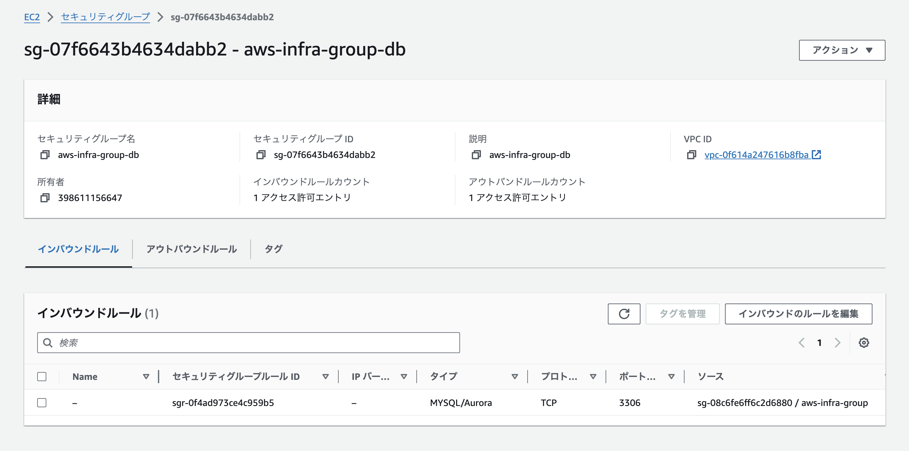

# 第4回課題

## 概要

**1. AWS上に新しくVPCを作成**

**2. EC2の構築**

**3. RDSの構築**

**4. EC2からRDSへ接続**

**5. 今回の課題から学んだこと、感じたこと**

 
## 内容 
 
**1. AWS上に新しくVPCを作成**

 

**2. EC2の構築**

 

**3. RDSの構築**
    
 

- RDSセキュリティーグループ

 

 

**4. EC2からRDSへ接続**

   

**5. 今回の課題から学んだこと、感じたこと**

EC2、RDSインスタンスの構築などに関しては、インターネット上に多くの情報が乗っているため、難易度は高く感じなかった。

しかし、設計が細かくなるにつれてサービスの位置関係を把握する必要があるため、頭の中でイメージできるかが大切だと実感。

起動したインスタンスを停止させてもEBS ボリュームはストレージとして存在し続けるためデータを保持している。そのため、EBS ボリュームのストレージ容量に応じて料金が発生する点には十分気をつけたい。
