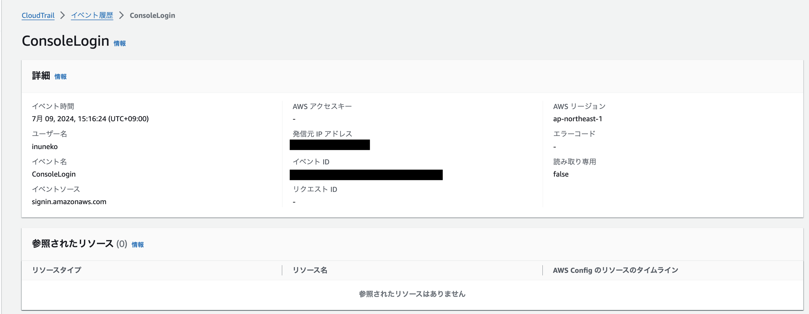
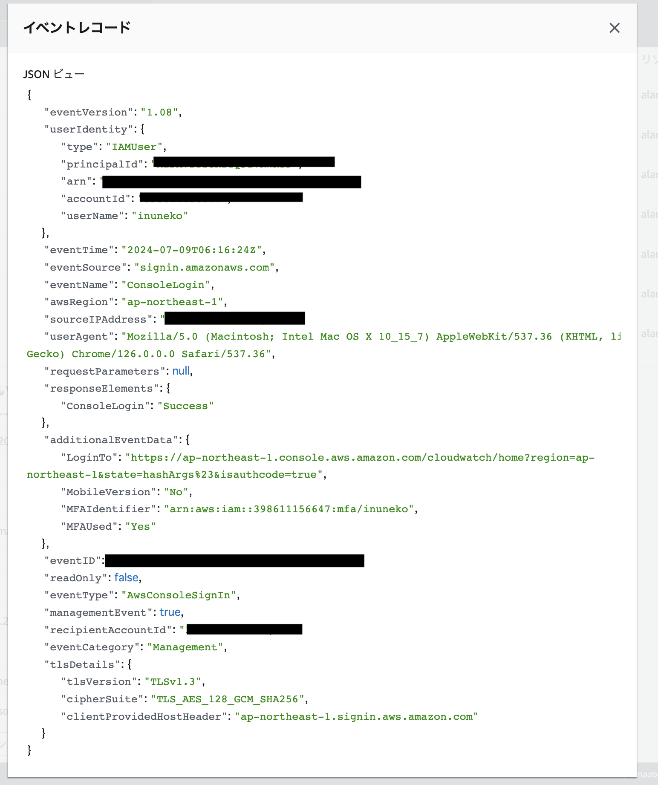
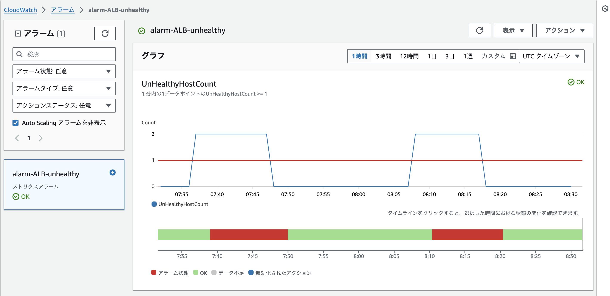
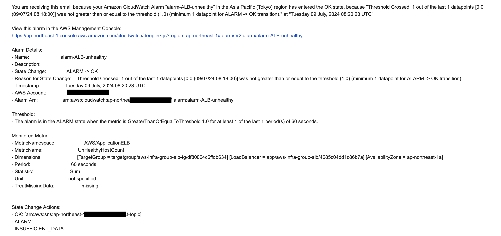
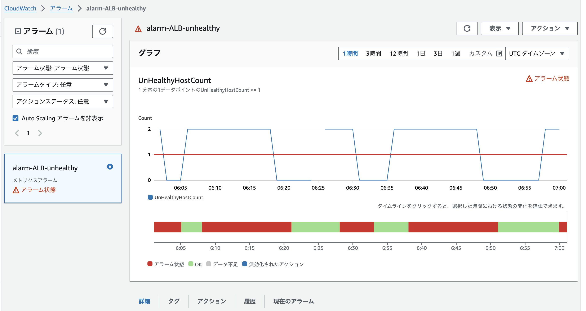
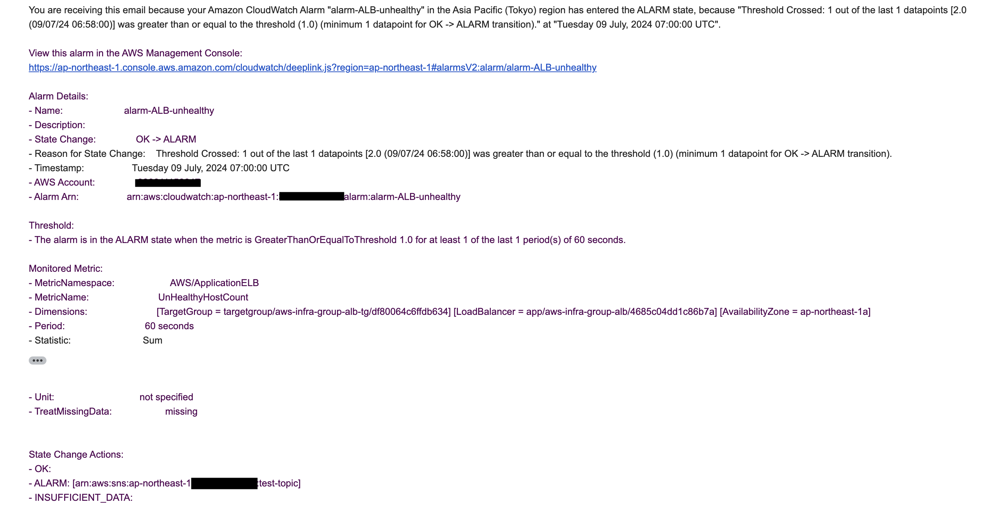
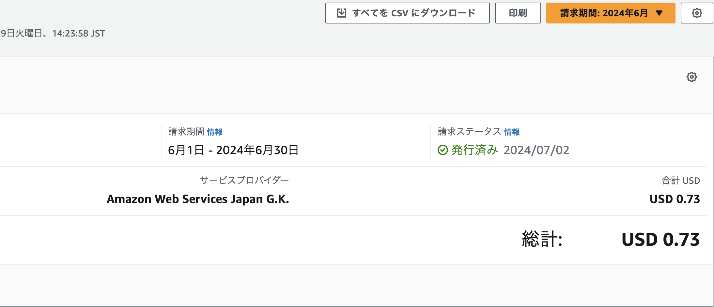
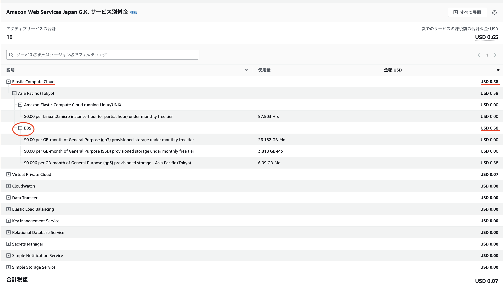

# 第6回課題

## インフラ安定稼働のためのAWSサービス

## 概要

### **1.  CloudTrailに記録されているイベントの抜粋**

### **2. CloudWatchで、ALBのアラームの設定、メールでの通知**

### **3. AWSサービス利用料の見積作成**

### **4. マネジメントコンソールから、現在の利用料の確認**

## 内容

### **1. CloudTrailに記録されているイベントの抜粋**

- 自身のIAMユーザー名のものを選択
- 抜粋したイベントを3つピックアップ

 

- イベントレコード

 

- イベントを３つピックアップ

    "eventTime": "2024-07-09T06:16:24Z"

    "eventSource": "signin.amazonaws.com"

    "eventName": "ConsoleLogin"

### **2. CloudWatchでALB のアラームの設定、メールでの通知**

- [__第5回課題__](https://github.com/inuneko-git/RaiseTech/blob/main/lecture05.md)で作成した環境を使用
- アラーム機能を使い、ALBに紐づくEC2インスタンスが<u>Healthy/Unhealthy</u>の時に通知
- メールはAmazon SNSを使用

1. OKアクションの場合

 

 

2.  NGアクションの場合

- サンプルアプリケーションを停止させる

 

 

### **3. AWSサービス利用料の見積作成**

- 第5回課題までに使用したAWSサービス利用料の見積作成

[My Estimate](https://calculator.aws/#/estimate?id=48a0eab222e8fbf9a724ed130b2202b56a1df1e5)

### **4. マネジメントコンソールから、現在の利用料を確認**

- 先月（2024年6月）の利用状況、及びEC2料金の確認

 

 

- 無料利用枠を超えている

→ 課題を進めていく中で、動作確認のためCloud9環境の複数の立ち上げやEC2のEBSサイズを上げて作業をした。また、EC2の停止をすれば料金は発生しないものと思い込んでおり、EBSボリュームの削除せず放置してしまっていた。結果、EBS のストレージスペースが無料枠を超えてしまい料金が発生。
