# 第10回課題

### **CloudFormation**を使いこれまでに作成した環境をコード化する

### 概要

**1. VPC**

**2. EC2**

**3. RDS**

**4. ALB**

**5. S3**

**6. EC2からRDSへ接続確認**

* * *

### テンプレート

-  [**VPC.yml**](CloudFormation/VPC.yml)

-  [**Security.yml**](CloudFormation/Security.yml)

-  [**Application.yml**](CloudFormation/Application.yml)

 
### **1. VPC**

 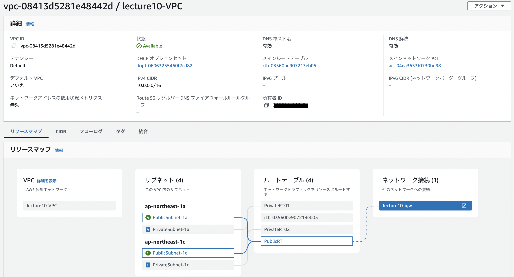

### **2. EC2**

 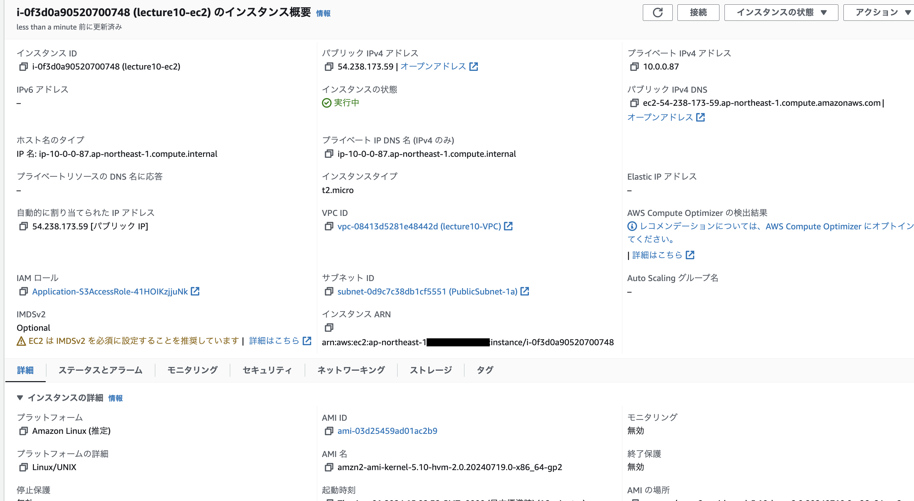

- #### セキュリティーグループ

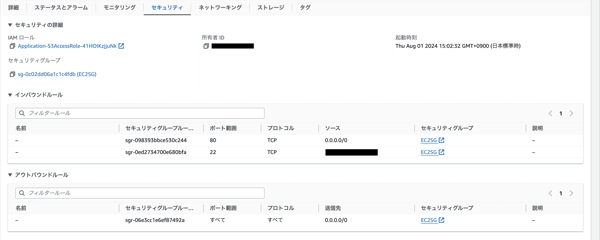

### **3. RDS**
    
 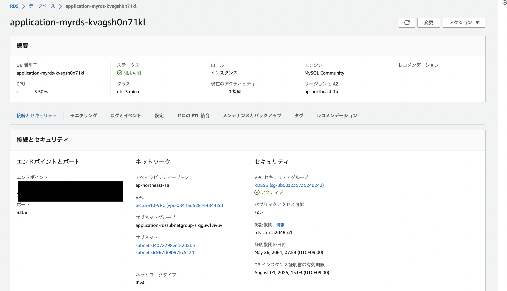

- #### サブネット

 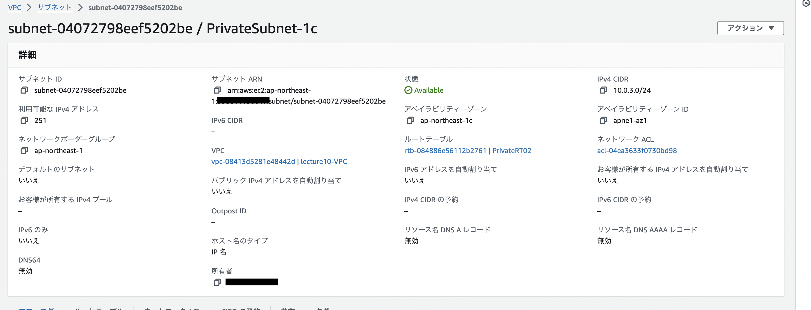

 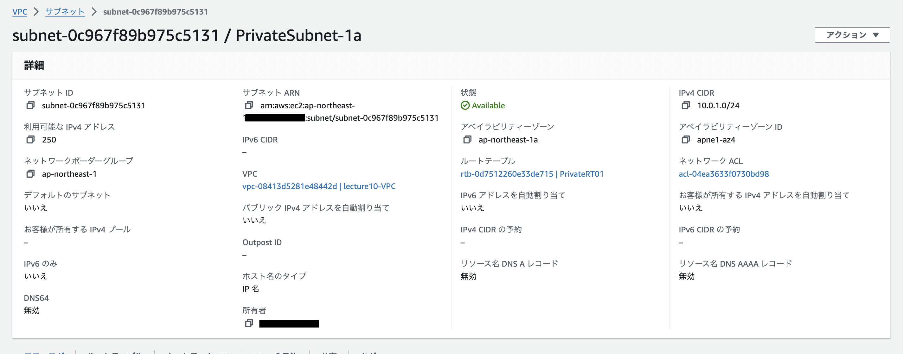

- #### セキュリティーグループ

 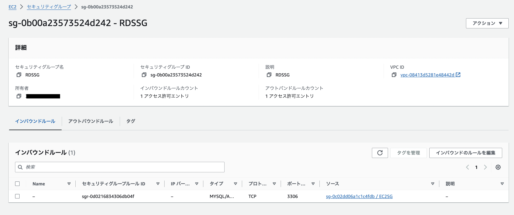

### **4. ALB**

 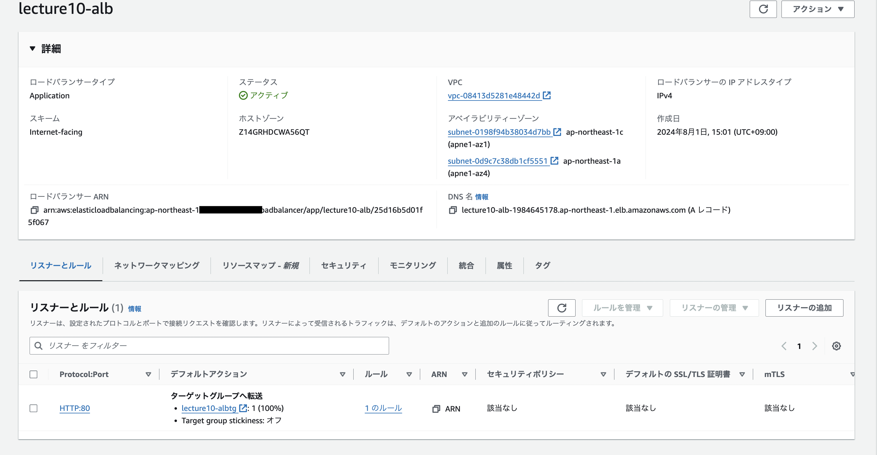

- #### ターゲットグループ

 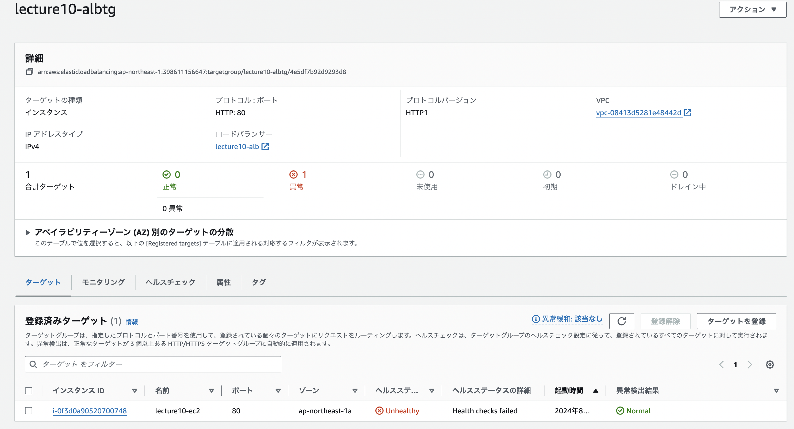

### **5. S3**

 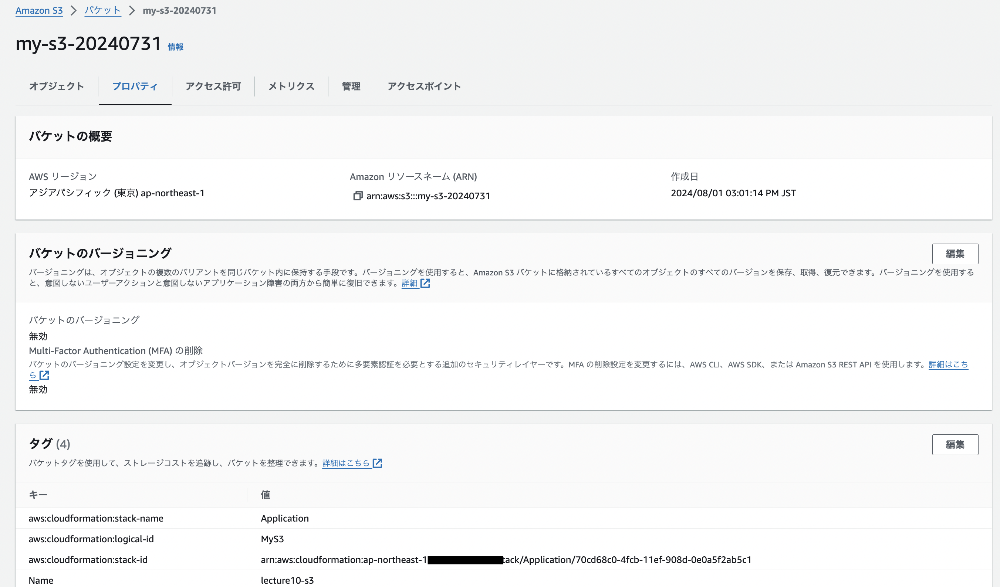

### **6. EC2からRDSへ接続確認**

 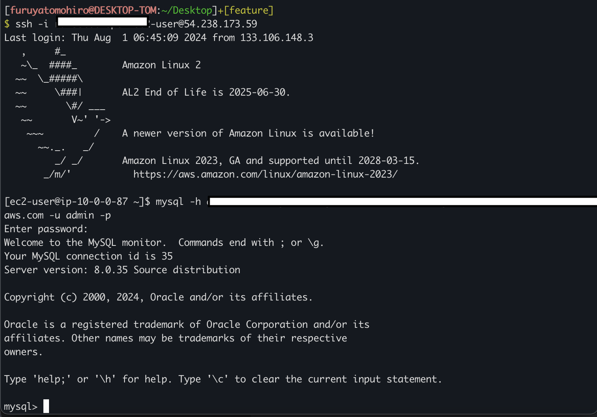  

### **感想**
他のスタックから情報をインポートする際、正しく記述しているつもりでも「No export named ~~~ found」というロールバックが何度も発生。
しかし、エラー対応を繰り返していくうちにファイル形式にも慣れて理解が深まった。

1つのスタックにまとめて作成するパターンにも挑戦したい。